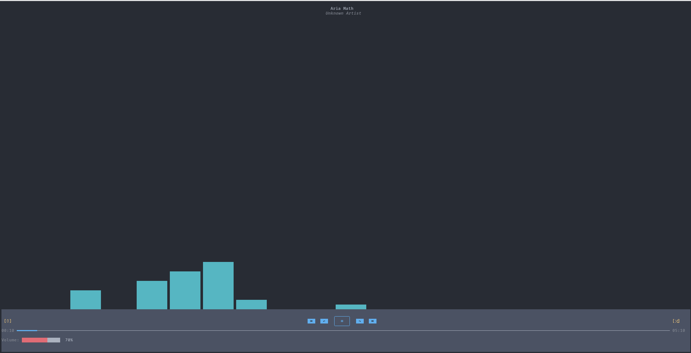
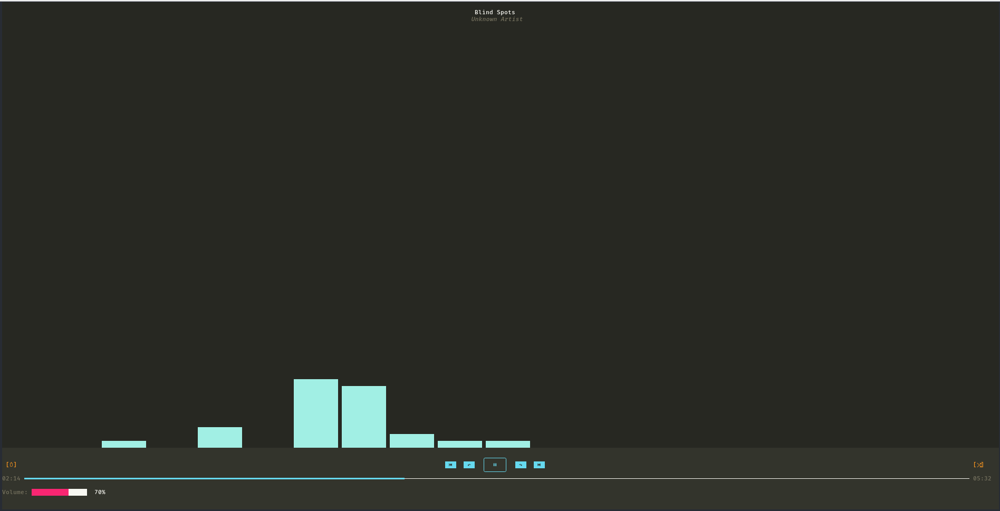

# CLImusic

An interactive in terminal audio player. Support file or directory opening.

## Features

- Plays audio files
- Supports MP3, WAV, FLAC, OGG, and AIFF
- Supports playlists (folders with audio files)
- Volume control
- Normal, loop, and random modes
- Can be themed with colorschemes
- support keyboard shortcuts

## Keyboard shortcuts

- `SPACE`: Play/pause
- `q`: Quit
- `LEFT`: Seek -5
- `RIGHT`: Seek +5
- `+`, `UP-ARROW`: Increase volume
- `-` `DOWN-ARROW`: Decrease volume 
- `m`: Cycle through modes
- `n`: Next track
- `p`: Previous track

## Themes

There are 2 default themes included:
Atom One Dark | 
-|-
Monokai | 

You can create your own theme by editing the `colorschemes` folder and adding a JSON file with the following format:

```json
{
  "bg": [R, G, B],
  "fg": [R, G, B],
  "red": [R, G, B],
  "green": [R, G, B],
  "yellow": [R, G, B],
  "blue": [R, G, B],
  "magenta": [R, G, B],
  "cyan": [R, G, B],
  "gutter": [R, G, B],
  "comment": [R, G, B]
}
```

The `bg` and `fg` colors are the background and foreground colors of the terminal. The other colors are used for various elements of the player.
